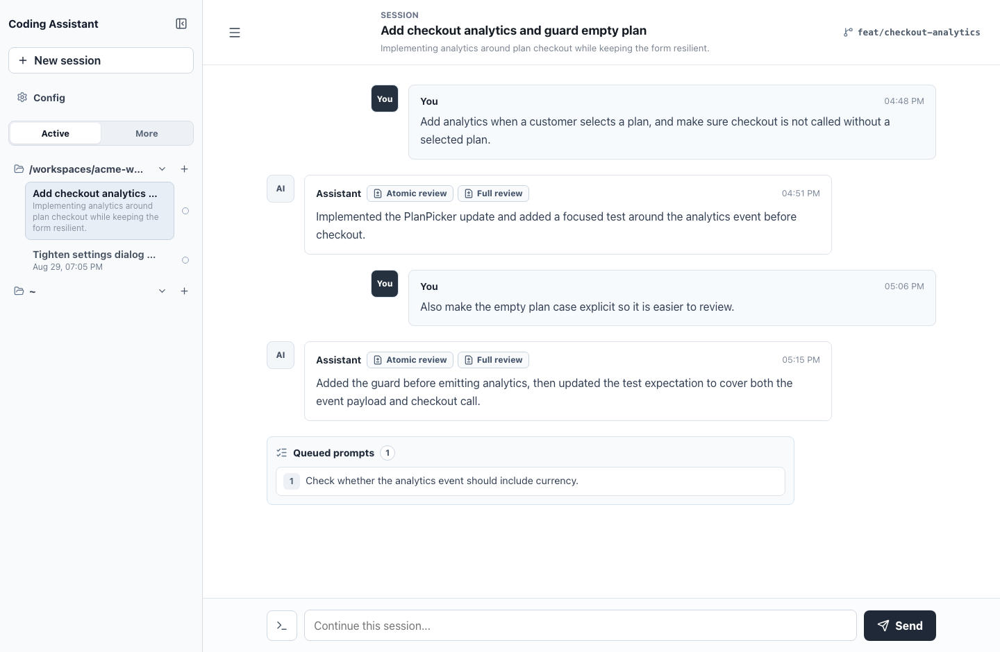
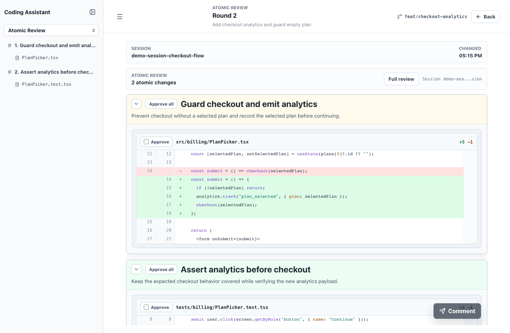

# CUI

[简体中文](README.md) | English

CUI is a coding agents UI designed for better collaboration between humans and AI. It keeps AI harness-backed coding sessions, execution output, review artifacts, and follow-up prompts in one workspace-oriented interface.

## Features

- Persistent coding sessions grouped by workspace, with active and paginated historical views.
- Chat and shell-command modes from the same composer.
- Streaming assistant output with expandable execution traces.
- Round-based review entry points for changes produced by an assistant turn.
- Atomic review mode that splits a round diff into smaller reviewable capabilities.
- Inline review comments that can be sent back into the original session as follow-up prompts.
- Backend AI harness, model, and reasoning-effort configuration for normal replies, summaries, and atomic review.

## Screenshots

The screenshots below use fake demo data only.





## Quick Start

```sh
npm install
npm run build
npm run start
```

Open `http://localhost:5173/`.

By default, the production preview web app runs on port `5173` and talks to the local API on port `3000`.

## Runtime Data

`npm run start` stores production-preview data under `prod/` by default:

- Session data: `prod/data/sessions.json`
- API logs: `prod/logs/`

Use custom paths when you want an isolated local dataset:

```sh
npm run start -- --store-path prod/data/local-sessions.json --log-dir prod/local-logs
```

## Developer Docs

Development workflow, scripts, ports, and test notes live in [DEVELOPMENT.md](DEVELOPMENT.md).
